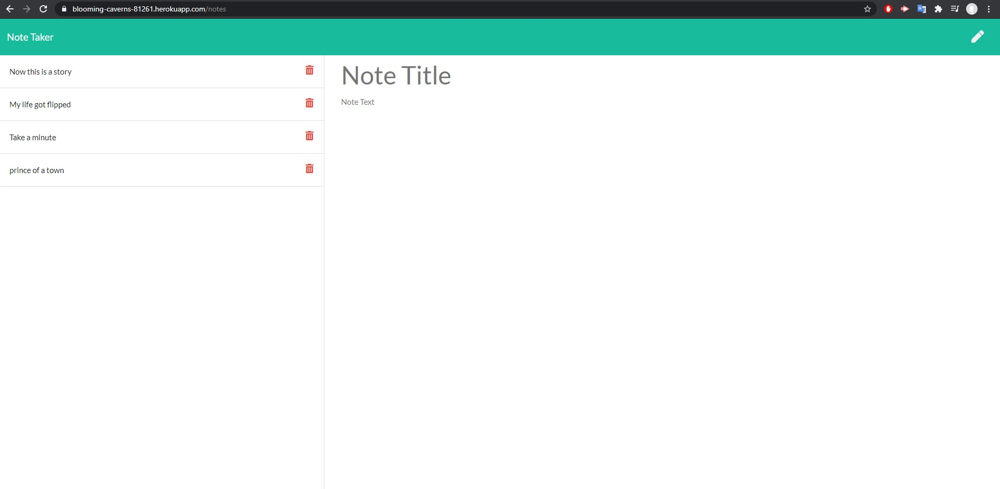

# Note_Taker

## Description
This application can be used to write, save, and delete notes. This application uses backend and save and retrieve note data from a JSON file. The user will be able to click add note and will enter a title and 

## Table of Content

- [Working-app](#working-app)
- [Installation](#installation)
- [Dependencies](#dependencies)
- [Contributors](#contributors)
- [Author](#author)
- [Images](#images)
- [Demo](#demo)
- [Copyright](#copyright)

## Working app

<https://blooming-caverns-81261.herokuapp.com/>

### Installation

There is no installation required

### Dependencies

- fs
- express
- path

### Contributors

zach-greenberg

### Licence

This project is licensed under the MIT- License

### Author

Zach Greenberg

### Images

### Demo

#### CopyRight

Copyright 2020 &copy; Zach Greenberg